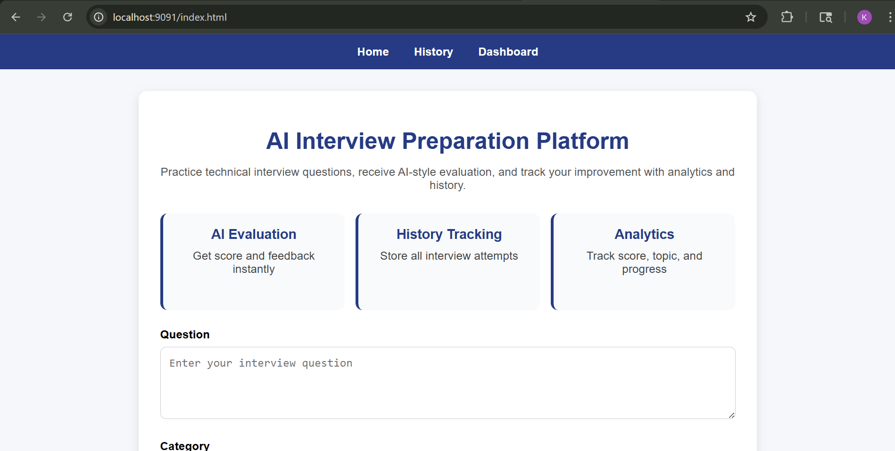
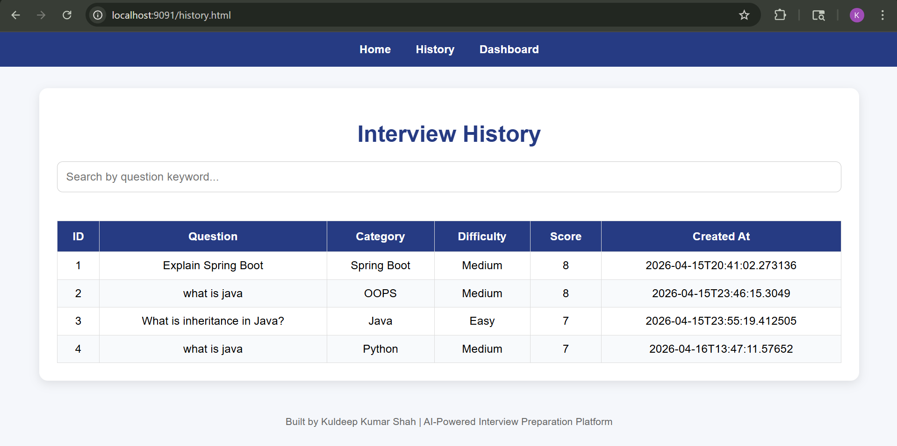
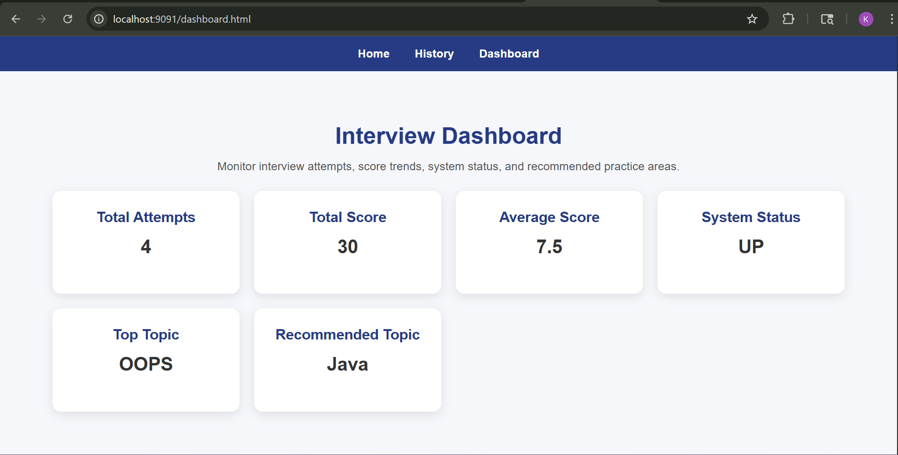

# AI-Powered Interview Preparation Platform

## Overview

This project is a backend system that simulates an AI interview platform.  
It allows users to ask interview questions, receive AI-generated answers, track history, analyze performance, and export data.

The system demonstrates real-world backend development using Spring Boot and REST APIs.

---

## Features

- Ask interview questions
- AI-style answer generation
- Score evaluation and feedback
- History tracking
- Search by keyword
- Filter by category and difficulty
- Pagination and sorting
- Leaderboard analytics
- CSV export
- Validation and exception handling
- Health and system APIs
- API key security
- Swagger API documentation

---

## Tech Stack

- Java 17
- Spring Boot
- Spring Data JPA
- MySQL
- Swagger UI
- Maven
- REST APIs

---

## API Base Path

/api/v1

---

## Important APIs

POST /api/v1/ask  
GET /api/v1/history  
GET /api/v1/summary  
GET /api/v1/recommendation  
GET /api/v1/leaderboard  
GET /api/v1/export/csv  

---

## How to Run the Project

1. Clone the repository

git clone https://github.com/kuldeepshah9578/ai-interview-preparation-platform.git

2. Open in Eclipse

3. Run:

AiPlatformApplication.java

4. Open Swagger:

http://localhost:9091/swagger-ui/index.html

---

## Screenshots

### Home Page

### History Page

### Dashboard Page

## Author

Kuldeep Kumar Shah  
Java Backend Developer  
Open to Software Developer Roles